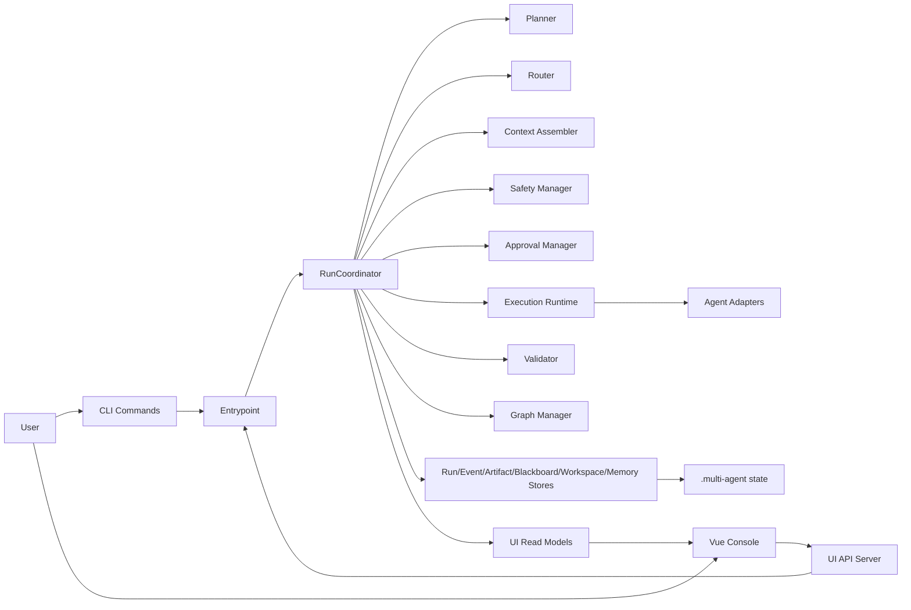
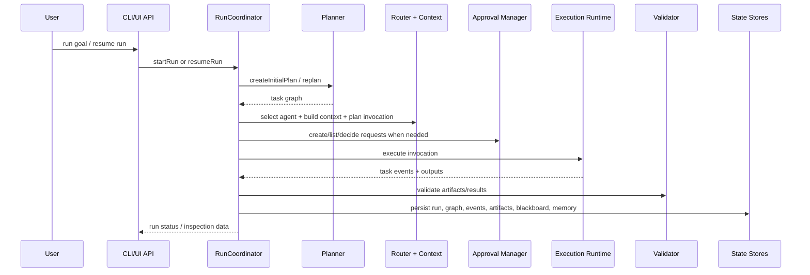

# clibees

Local-first multi-agent orchestration engine for terminal workflows, with approvals, event logs, persistent state, and a Vue console.

面向本地工作区的多代理编排引擎，提供审批门禁、事件审计、状态持久化，以及配套的 Vue 控制台。

## Why clibees

`clibees` is built for teams who want agentic workflows without giving up local control. It keeps execution close to the repository, records what happened, and exposes the run lifecycle through both a CLI and a browser console.

`clibees` 适合希望把智能代理真正接入本地仓库工作流的团队。它把执行放在本地，把过程写入状态和事件流，再通过 CLI 与控制台把整条运行链路展示出来。

- Local-first runtime with file-based state under `.multi-agent/`
- Run/task orchestration with explicit status transitions
- Approval gating for risky actions
- Event log, artifacts, blackboard summaries, and inspect APIs
- Separate Vue 3 console for workspace and run inspection

## What Exists Today

The current repository already includes:

- A TypeScript runtime that creates runs, plans tasks, routes agents, builds context, executes work, validates results, and persists state
- CLI commands for `run`, `resume`, `inspect`, `approvals`, `approve`, and `reject`
- A Node HTTP UI API for run creation, run inspection, resume, and approval decisions
- A Vue 3 + Vite console application for workspace, runs, approvals, and inspection views
- File-based stores for run metadata, graphs, events, artifacts, approvals, blackboard summaries, workspace drift, and project memory
- Compiled regression tests covering storage, execution, approvals, and multi-phase coordinator behavior

## Architecture At A Glance




`clibees` centers the control plane in `RunCoordinator`: it connects planning, routing, approval, execution, validation, persistence, and inspection into one local orchestration loop.

`clibees` 的控制中心是 `RunCoordinator`。规划、路由、审批、执行、校验、持久化、读模型聚合都围绕它闭环。

## Runtime Flow




The important design choice is not "agents generate output", but "runs become inspectable state machines".

这里真正重要的不是“代理生成了内容”，而是“每一次运行都被收敛成可检查的状态机和审计轨迹”。

## Technology Map


- Runtime: TypeScript, Node.js, strict `tsc`
- Control surfaces: CLI entrypoint and Node HTTP UI API
- UI: Vue 3, Vue Router, Vite
- Persistence: file-based stores under `.multi-agent/`
- Core subsystems: planner, graph manager, router, context assembler, safety manager, approval manager, execution runtime, validator, projection builders
- State model: run/task lifecycle, event stream, artifacts, blackboard summaries, project memory

## Quick Start

### Prerequisites

- Node.js 22+
- npm

### Install and verify

```bash
npm install
npm run check
npm run build
npm test
```

To build the console app:

```bash
cd apps/console
npm install
npm run build
```

### Run from the CLI

Use the default config in `.multi-agent.yaml`, or pass `--config <path>`.

```bash
npm run start -- run "your goal"
npm run start -- resume <runId>
npm run start -- inspect <runId>
npm run start -- approvals <runId>
npm run start -- approve <runId> <requestId> --actor <name> --note "optional note"
npm run start -- reject <runId> <requestId> --actor <name> --note "optional note"
```

## State And Output Layout

Runtime state is written under `.multi-agent/`.

- `.multi-agent/state/runs/<runId>/run.json`: run metadata
- `.multi-agent/state/runs/<runId>/graph.json`: persisted task graph
- `.multi-agent/state/runs/<runId>/events.jsonl`: raw run events
- `.multi-agent/state/runs/<runId>/artifacts/`: archived artifacts
- `.multi-agent/state/runs/<runId>/blackboard/`: projected summaries
- `.multi-agent/state/runs/<runId>/approvals.json`: approval requests and decisions
- `.multi-agent/memory/records.jsonl`: project memory history
- `.multi-agent/memory/index.json`: project memory scope and tag index

## Repository Layout

- `src/`: CLI, runtime, orchestration, decision, execution, storage, UI API, and read-model builders
- `apps/console/`: Vue console application
- `docs/`: architecture notes, frozen contracts, and public-facing project documentation
- `.multi-agent.yaml`: local workspace and agent configuration

## Documentation

- [Project overview](docs/overview.md)
- [Architecture and diagrams](docs/architecture.md)
- [State machine freeze](docs/state-machine-freeze.md)
- [Control entrypoint inventory](docs/control-entrypoint-inventory.md)

## Current Positioning

This repository is not just a demo UI and not yet a full production platform. It is a working orchestration core with a visible control surface, persistent local state, and evolving architecture contracts.

这个仓库不是纯概念 Demo，也还不是完整商用平台。它目前更像一个已经可运行、可检查、可扩展的本地多代理编排内核。

## License

Open source repository: <https://github.com/Acrashpotato/clibees>
