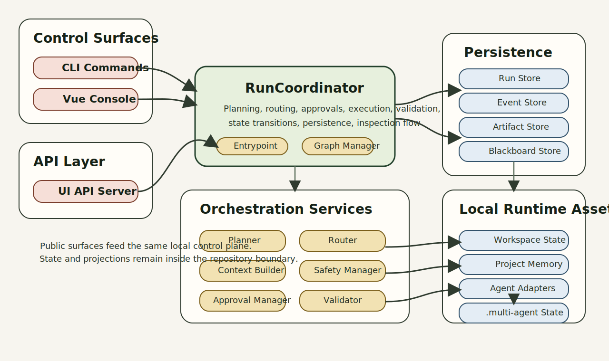
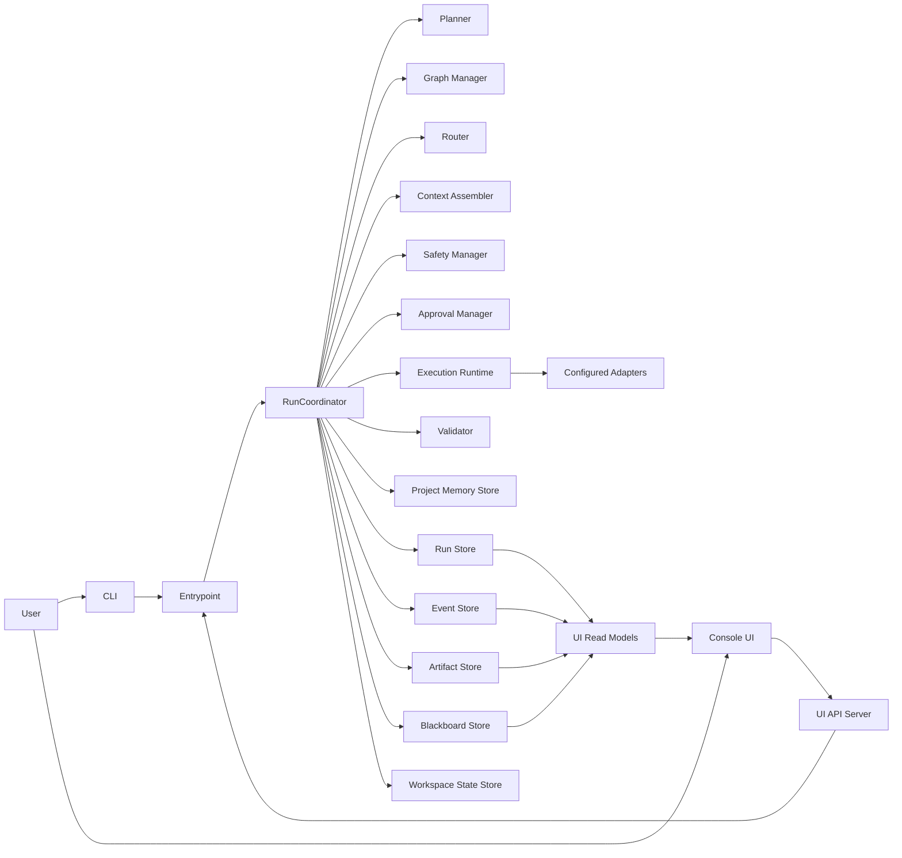
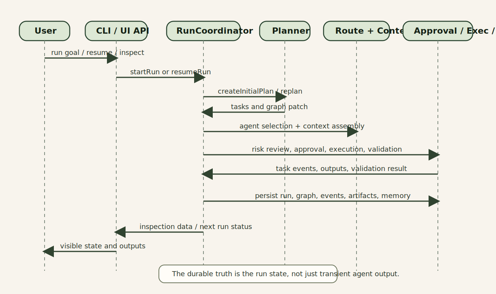
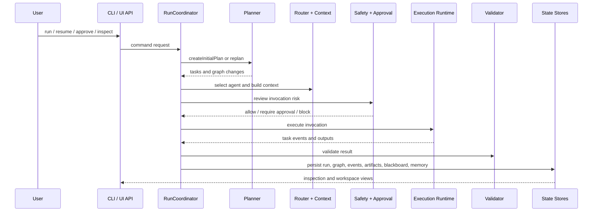
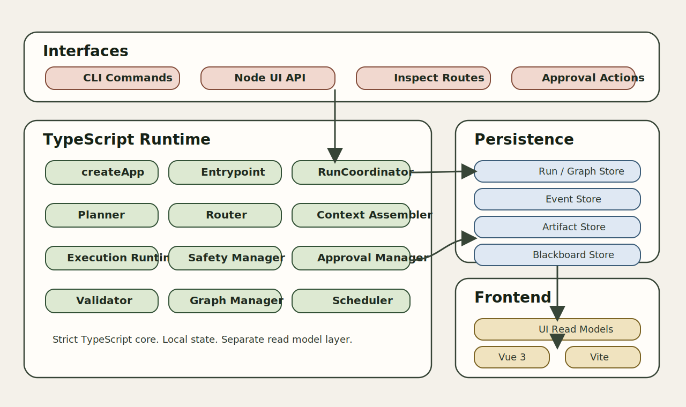
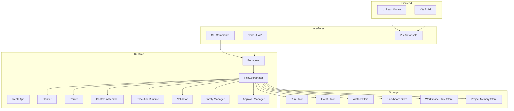

# clibees Architecture

## System Summary

`clibees` is organized around a local orchestration loop:

1. Accept a goal through CLI or UI API
2. Create a run and initial task graph
3. Route work to an adapter-capable agent
4. Build context from workspace, memory, and previous artifacts
5. Gate risky actions through approvals
6. Execute, validate, and persist every important result
7. Read the same persisted state through inspect and console projections

## Architecture Overview

Static export:

Mermaid source:

## Runtime Sequence

Static export:

Mermaid source:

## Technology Map

Static export:

Mermaid source:

## Module Responsibilities

### Control plane

- `src/app/create-app.ts` wires the runtime dependencies
- `src/control/run-coordinator.ts` is the central orchestration loop
- `src/control/graph-manager.ts` manages task graph creation and graph patches
- `src/control/scheduler.ts` chooses the next runnable task

### Decision layer

- `src/decision/planner.ts` defines planning and replanning
- `src/decision/router.ts` selects an agent/profile
- `src/decision/context-assembler.ts` builds execution context
- `src/decision/validator.ts` validates task results

### Execution layer

- `src/execution/execution-runtime.ts` runs invocations
- `src/execution/approval-manager.ts` manages approval requests and decisions
- `src/execution/safety-manager.ts` classifies risky actions
- `src/execution/create-adapter-registry.ts` exposes agent adapters

### Read surface

- `src/cli/` provides the command-line interface
- `src/ui-api/` exposes HTTP routes for the console
- `src/ui-read-models/` converts stored state into console-facing projections
- `apps/console/` renders the workspace and inspection UI

### Persistence

- `src/storage/` stores run records, graphs, events, artifacts, approvals, blackboard summaries, workspace drift, and memory indexes
- `.multi-agent/` is the runtime state root used by the local orchestration loop

## Architectural Notes

- The repository already behaves like a real orchestration engine, not just a scripted wrapper around a single agent call.
- Many deeper freeze documents in `docs/` define the intended evolution toward richer task/session/read-model boundaries.
- Public-facing materials should distinguish between current runtime behavior and planned architecture refinements.
